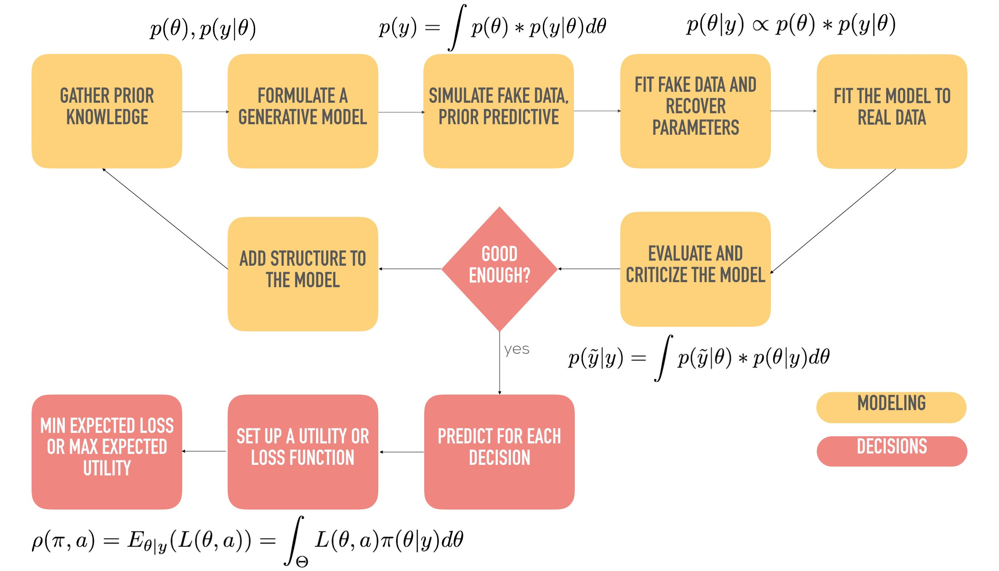

# Main idea concepts

## What is the software application? 

A SaaS tool for Data Analyst and Data Scientists to run Bayesian Models without having to concern themselves with infrastructure and Bayesian Best Practices (Bayesian Workflow)

## Who’s it intended for? 

### Data Analysts / Domain Experts
1. People without Statistics knowledge, or basic Statistics knowledge
2. Don't have the time or the knowledge to follow a full bayesian workflow and proper methodological / statistics checks
3. Need to be able to perform insights on a quick turnaround without having to delve deeply in Advanced Statistics or infrastructure 
4. Need ready made models with proper best practices (eg. pre-selected priors)

### Data Scientists
1. People with medium to advanced statistics knowledge
2. Want to be able to perform quick analysis without having to deal with infrasctruture and / or performance
3. Want the ability to fine tune assumptions or priors
4. Want the ability to tinker the model assumptions

### Advanced Analytical teams
1. People with advanced statistics knowledge
2. With the ability to create and test their own advanced models and are knowledgable of modelling best practices
3. Do not want / can't deploy their own infrastructure and maintain it.
4. Want the ability to write custom made model and have a quick turnaround to production

### What problem does the software solve? 
1. Gives Data Analysts and Domain experts a way to quickly do statistical analysis on data without full knowledge of advanced statistics / Bayesian Workflow
2. Gives Advanced Data Analysts / Data Scientists a way to quickly follow Best Practices with quick turnarounds (avoing corner cutting due to time constraints)
3. Give Advanced Analytical teams a ready to use & flexible infrastructure to deploy their custom made models

### How is it going to work? 
#### MVP (v1)
There are a set of pre-built models (calibrated with best practice Priors) running on a Probabilistic Programming Framework.  
The user uploads data, and selects the type of data it has, what question is he aiming to answer, and the platform will select a sub-set of models best suited to running said problem.  
The platform will then take the analyst through the proper steps for the Bayesian Workflow, so as to insure Best Practices are followed.

### "Scratch your own itch" (v0.1)
With this tool, you should be able to run analysis on topics you are interested, without having to constantly remember what is the proper workflow and tests needed to correctly identify what you are analyzing without remembering or constantly re-referencing your Statistical Library. A good use is analysis for your Substack [Honest Data](https://honestdata.substack.com/), to build SEO / audience.

#### Simple Bayesian Workflow

#### Full Bayesian Workflow

More details: [Bayesian Workflow](https://arxiv.org/abs/2011.01808)

# UI

## What are the main user stories (happy flows + alternative flows)? 

### As a user I want ...
1. to login
2. to register
3. to recover my password
4. to upload data
5. to select the question I'm trying to answer
6. to specify the types of the data I have
7. to see the chosen models, and select 1
8. to see the steps in the workflow
9. to see the assumptions and priors of the model
10. to see the results of the modelling
11. Share the results of the modelling
12. Export the results of the modelling
13. Save the model for future use
14. Edit the current model assumptions and priors
15. Create a new model from scratch online
16. Add an custom model from file

# Technical Specification

## What technical details need developers to know to develop the software or new feature? 
1. Models need to run in backend using a PPL (Pyro or pymc3)
2. Model running and backend need to be decopled to allow ability to change backend
3. Model Engine needs the ability to receive a new python Model from "outside", and still be able to be used by the Runner
4. Data Loaders need to be generic, to be able to receive any data possible for analysis
5. Model runner should be async, in a way that frontend will send data, and the model with work on the background and inform user it is ready in the background

## Are there new tables to add to the database? What fields? 
Users:
user_id,
username,
user_email,
super_user

Models:
model_id,
model_name,
model_family

## How will the software technically work? Are there particular algorithms or libraries that are important? 
1. PPL, either STAN, pymc3 or (num)Pyro
2. FastAPI
3. Vue.js
4. Piston
5. Pydantic
6. SQL Alchemy

## What will be the overall design? Which classes are needed? What design patterns are used to model the concepts and relationships? 

### TBD

# Deployment

## Are there any architectural or DevOps changes needed (e.g. adding an extra microservice, changes in deployment pipelines, adding secrets to services)? 

### Enviroments
1. Development:  
    version of the code running on your local development machine
2. Test:
    version of the application that runs in the cloud, similar to the production environment
3. Staging:
    version of the application that runs in the cloud, as close as possible to the production environment, with copy of prod DB
4. Production

**Note:**
Test deployment in Azure vs AWS

### Components
All components are running on Docker Instances on all environments.  
Follow best practices using the following template:  
[Full Stack FastAPI PostgreSQL](https://github.com/tiangolo/full-stack-fastapi-postgresql)
#### 1. Frontend
NodeJS image running Vue.js frontend
#### 2. DB
PostgreSQL image running database
#### 3. Redis
Redis instance for worker jobs to be queued and results stored
#### 4. Celery
Celery Workers to read Redis queue, execute model, and store results in Redis.  
Python3.9-slim image.
#### 5. FastAPI
API backend for comunication between Frontend and back end services like workers.  
Python3.9-slim image.
#### 6. Model Engine
Backend server to setup and Run Models.
Python3.9-slim image.

# Planning

## How much time will developing the software cost? 

### to v0.1: 
30 to 45 days
### to v1: 
60 to 90 days

## What are the developmental milestones and in what order? 
1. Setup enviroments and docker instances
2. Develop Model Engine
    a. Data Loader
    b. Model Config
    c. Model plugin
    d. Model Runner
    e. Results Exporter
3. Develop FastAPI Endpoints
    a. Handle Users
    b. Data Uploader
    c. Model writer / importer
    d. Model Config
    e. Model Runner
    f. Model data transfer to UI
4. Develop UI
    a. Login Screen
    b. Data Loader
    c. Model writer / importer
    d. Model and data selector
    e. Results visualizer

## What parts are absolutely required, and what parts can optionally be done at a later stage? (i.e. the Definition of Done)

Items 2 and 3 from development roadmap are the essencial parts. 
UI can be basic and user Auth is not required for version 0.1